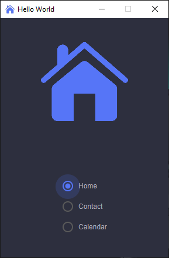
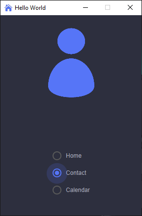
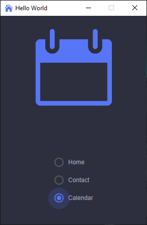
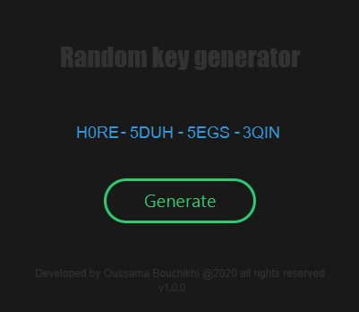
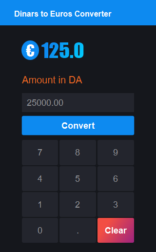

# JavaFX_Projects
Some small projects for university using JavaFX library

## Screenshot 📸
### Radio button

  
  
  

### Key Generator

### Currency converter

## License 📃
These projects are open-sourced under the [MIT license](https://opensource.org/licenses/MIT)
